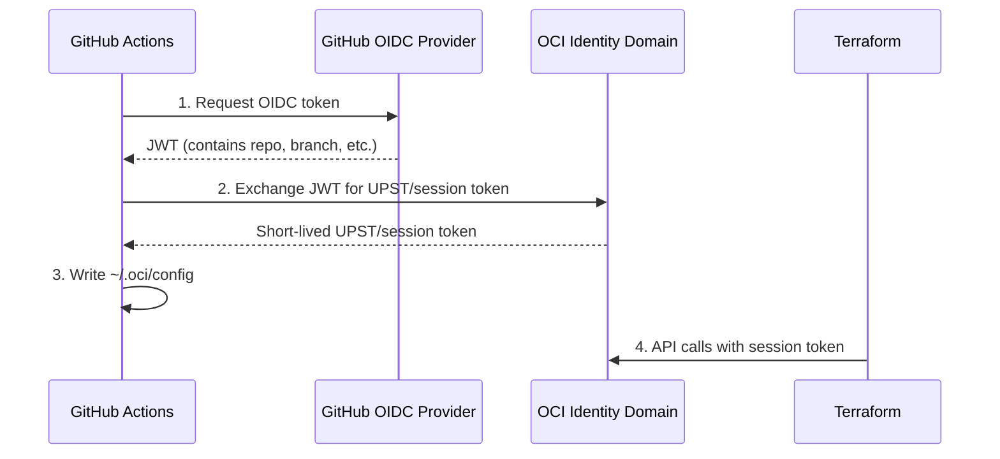

# OCI Terraform Provider with OIDC Token Exchange

Example repository demonstrating how to use the OCI Terraform provider with session token authentication via OCI IAM Workload Identity Federation (WIF) and OIDC token exchange from GitHub Actions. **No static OCI API keys needed.**

## Overview

This repository has two parts:

1. **WIF setup and usage** - Configure OCI IAM Workload Identity Federation, exchange a GitHub Actions OIDC JWT for an OCI UPST/session token, and run Terraform with `auth = "SecurityToken"`.
2. **Long-running Terraform refresh** - Keep Terraform authenticated during long-running operations by refreshing the OCI session token file while Terraform is still running.

The working examples cover:

1. **OIDC Token Exchange** - GitHub Actions token → OCI UPST/session token
2. **Terraform Authentication** - OCI provider using `SecurityToken` mode
3. **Resource Creation** - Creates an Object Storage bucket to validate the flow
4. **Token Refresh** - Demonstrates refresh during a simulated long-running Terraform apply

The included Python action (`oci-token-exchange/`) is fully documented for educational purposes.

## Why Use This Pattern?

| Traditional (API Keys) | OIDC (This Example) |
|------------------------|---------------------|
| Long-lived OCI API keys stored in secrets | No OCI API keys stored in GitHub |
| Risk if compromised | Short-lived OCI session tokens |
| Manual rotation required | Automatic expiration |
| Broad permissions | Scoped to specific workflows/branches |

## Quick Start

### Prerequisites

Complete OCI setup first. See [SETUP.md](./SETUP.md) for detailed instructions.

**You need:**

1. OCI Identity Domain with Service User
2. OAuth Client Application registered
3. Identity Propagation Trust policy configured
4. GitHub secrets configured

### Usage

1. **Fork this repository**

2. **Configure GitHub Secrets** (Settings → Secrets and variables → Actions):

   | Secret | Example |
   |--------|---------|
   | `OIDC_CLIENT_IDENTIFIER` | `client_id:client_secret` |
   | `DOMAIN_BASE_URL` | `https://idcs-xxx.identity.oraclecloud.com` |
   | `OCI_TENANCY` | `ocid1.tenancy.oc1..aaa...` |
   | `OCI_REGION` | `us-ashburn-1` |
   | `COMPARTMENT_ID` | `ocid1.compartment.oc1..aaa...` |

3. **Run the workflow**:
   - Go to Actions → "Demo Terraform Apply (Standard)"
   - Click "Run workflow"
   - Select action: `plan`, `apply`, or `destroy`

4. **Run the long-running Terraform refresh demo**:
   - Go to Actions → "Demo Terraform Token Refresh"
   - Click "Run workflow"
   - The workflow runs `examples/long-running-refresh/` with token refresh enabled

## How It Works



### The Token Exchange Action

The `oci-token-exchange/` directory contains a simple Python action:

```
oci-token-exchange/
├── action.yml         # GitHub Action definition
├── main.py            # Token exchange logic (well-documented)
└── requirements.txt   # requests, cryptography
```

**`main.py` does 4 things:**

1. **Generate RSA key pair** - For signing OCI API requests
2. **Get GitHub OIDC token** - JWT with workflow context
3. **Exchange with OCI** - Trade JWT for OCI UPST/session token
4. **Configure OCI CLI** - Write `~/.oci/config`

Read the code - it's designed to be educational!

### Terraform Provider

```hcl
provider "oci" {
  auth                = "SecurityToken"
  config_file_profile = "DEFAULT"
  region              = var.oci_region
}
```

## Repository Structure

```
.
├── .github/workflows/
│   ├── demo-terraform-apply.yml          # Demo: Standard WIF + Terraform flow
│   └── demo-terraform-token-refresh.yml  # Demo: Long-running Terraform refresh
├── examples/
│   └── long-running-refresh/  # Advanced refresh demo for long Terraform runs
├── oci-token-exchange/        # Python action (read the code!)
│   ├── action.yml
│   ├── main.py
│   └── requirements.txt
├── terraform/                 # Example: creates Object Storage bucket
├── CONTRIBUTING.md
├── README.md
├── SETUP.md                   # OCI configuration guide
└── LICENSE.txt
```

## Long-Running Terraform Operations

OCI UPST/session tokens are short-lived. For Terraform jobs that may run for an extended period, use the token refresh mode instead of relying on OAuth application token lifetime settings.

### Enable Auto-Refresh

For Terraform jobs that may exceed the token lifetime, enable background refresh:

```yaml
- name: Configure OCI Authentication
  uses: ./oci-token-exchange
  with:
    oidc_client_identifier: ${{ secrets.OIDC_CLIENT_IDENTIFIER }}
    domain_base_url: ${{ secrets.DOMAIN_BASE_URL }}
    oci_tenancy: ${{ secrets.OCI_TENANCY }}
    oci_region: ${{ secrets.OCI_REGION }}
    enable_token_refresh: true          # Enable background refresh
    refresh_interval_minutes: 50        # Refresh every 50 minutes
```

This spawns a background daemon that re-exchanges the GitHub OIDC token for a fresh OCI session token before the current token expires. The `Demo Terraform Token Refresh` workflow runs a Terraform apply under `examples/long-running-refresh/` to demonstrate the pattern.

## Related Resources

- [SETUP.md](./SETUP.md) - Step-by-step OCI configuration
- [Common issues](./SETUP.md#common-issues) - Setup and runtime troubleshooting
- [Long-running Terraform refresh example](./examples/long-running-refresh/)
- [OCI JWT-to-UPST Token Exchange](https://docs.oracle.com/en-us/iaas/Content/Identity/api-getstarted/json_web_token_exchange.htm)
- [OCI Identity Propagation Trust](https://docs.oracle.com/en-us/iaas/Content/Identity/identitypropagationtrust/manage-identity-propagation-trust.htm)
- [GitHub OIDC Security Hardening](https://docs.github.com/en/actions/deployment/security-hardening-your-deployments/about-security-hardening-with-openid-connect)

## License

Copyright (c) 2025 Oracle and/or its affiliates.
Licensed under the Universal Permissive License v1.0.
