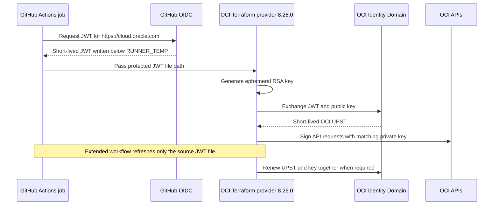

# OCI Workload Identity Federation for GitHub Actions

*Current on 12 August 2026*

This repository shows GitHub Actions authentication to Oracle Cloud
Infrastructure (OCI) with short-lived GitHub OIDC tokens and OCI Workload
Identity Federation (WIF). It does not use an OCI user API key.

- [Terraform examples](./examples/terraform/README.md)
- [Ansible examples](./examples/ansible/README.md)

Read [SETUP.md](./SETUP.md) first. It explains the OCI trust, IAM policy, and
GitHub secrets needed by both examples.

## Authentication flow

## Important

- Run workflows from `main`. The OCI trust matches this exact branch.
- Never use `sub eq *` in the trust.
- Do not print or upload tokens, private keys, client secrets, or state files.

## License

Copyright (c) 2026 Oracle and/or its affiliates. Licensed under the Universal
Permissive License v1.0.
