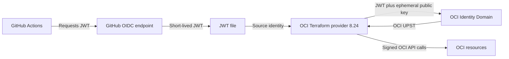

# OCI Terraform Provider with Native WIF from GitHub Actions

*Technical example current on 27 July 2026*

This repository shows how a GitHub Actions workflow can call Oracle Cloud Infrastructure (OCI) through OCI IAM Workload Identity Federation (WIF). It uses the native `WorkloadIdentityFederation` authentication supported by OCI Terraform provider 8.24.0. No OCI user API key, browser login, generated OCI configuration file, or external UPST wrapper is required.

## Native WIF provider baseline

The original version of this repository used provider 7.29 and a Python wrapper that created an RSA key, exchanged the GitHub JWT for an OCI UPST, and configured Terraform with `auth = "SecurityToken"`.

Provider 8.24.0 performs those operations itself:

1. Terraform reads the GitHub OIDC JWT from a protected file.
2. The provider generates an ephemeral RSA key pair.
3. The provider exchanges the JWT for an OCI UPST.
4. The provider signs OCI API requests with the matching private key.
5. The provider renews the UPST and key together when required.

The normal local action in `github-oidc-token/` uses official `actions/github-script@3a2844b7e9c422d3c10d287c895573f7108da1b3` (`v9.0.0`) to obtain the GitHub JWT. It writes the JWT atomically below `RUNNER_TEMP`, exports only its path, does not refresh it, and never creates OCI credentials. The standard Terraform and Ansible workflows use this one-shot action.

## Architecture



## Prerequisites

Complete the one-time OCI configuration in [SETUP.md](./SETUP.md). You need:

- An OCI Identity Domain service user and least-privilege IAM policy.
- An OCI Identity Domain confidential application for token exchange.
- One active GitHub Identity Propagation Trust with exact audience and subject restrictions.
- A GitHub Actions workflow with `id-token: write` permission.
- OCI Terraform provider 8.24.0 or later in the 8.x series.

## GitHub configuration

Create these repository secrets:

| Secret | Purpose |
|---|---|
| `OCI_WIF_CLIENT_ID` | Client ID of the OCI token-exchange application |
| `OCI_WIF_CLIENT_SECRET` | Client secret of the OCI token-exchange application |
| `DOMAIN_BASE_URL` | OCI Identity Domain URL |
| `OCI_REGION` | OCI region, for example `eu-madrid-1` |
| `COMPARTMENT_ID` | Protected `oci-validation` environment secret for the target compartment OCID |

For migration compatibility, the workflows also accept the original combined `OIDC_CLIENT_IDENTIFIER` secret in `client_id:client_secret` format. The separate `OCI_WIF_*` secrets take precedence.

The tenancy OCID is not required by the provider's WIF configuration. The provider obtains the principal and tenancy context from the OCI token. Terraform jobs read `COMPARTMENT_ID` only from the protected `oci-validation` environment; a workflow input cannot redirect an apply to another compartment.

## Terraform configuration

```hcl
terraform {
  required_providers {
    oci = {
      source  = "oracle/oci"
      version = ">= 8.24.0, < 9.0.0"
    }
  }
}

provider "oci" {
  auth   = "WorkloadIdentityFederation"
  region = var.oci_region
}
```

The workflows supply the remaining configuration through environment variables:

```text
OCI_WORKLOAD_IDENTITY_TOKEN_PATH
OCI_TOKEN_EXCHANGE_DOMAIN_URL
OCI_TOKEN_EXCHANGE_AUTH=OAuthClientCredentials
OCI_TOKEN_EXCHANGE_CLIENT_ID
OCI_TOKEN_EXCHANGE_CLIENT_SECRET
OCI_TOKEN_EXCHANGE_REQUESTED_TOKEN_TYPE=urn:oci:token-type:oci-upst
OCI_TOKEN_EXCHANGE_SUBJECT_TOKEN_TYPE=jwt
```

## Run the example

1. Fork the repository and complete [SETUP.md](./SETUP.md).
2. Add the GitHub secrets listed above.
3. Open **Actions** and select **Demo Terraform Apply (Standard)**.
4. Run `plan` first.
5. Optionally run `apply-and-destroy` to create a private validation bucket and remove it in the same workflow run. Both Terraform workflows run in the protected `oci-validation` GitHub environment.

The example intentionally keeps Terraform state local to the job. It does not support creating a bucket in one workflow run and destroying it in a later run. Use a remote backend for persistent infrastructure.

## Long-running Terraform operations

The OCI provider automatically renews its OCI UPST, but it cannot call GitHub to replace an expired source JWT. For a long Terraform process, the custom `github-oidc-token-refresh/` extension can refresh only the GitHub JWT file:

```yaml
- name: Create refreshable GitHub OIDC token file
  uses: ./github-oidc-token-refresh
  with:
    audience: https://cloud.oracle.com
    refresh_interval_minutes: 1
```

The provider rereads this file when it needs another OCI token exchange. It continues to own the OCI UPST and proof-of-possession key, so they cannot become mismatched.

GitHub OIDC JWTs expire roughly five minutes after issuance (an observed lifetime that GitHub does not officially document). The action therefore accepts refresh intervals only from 1 through 4 minutes.

The **Demo Terraform Token Refresh** workflow defaults to a two-minute smoke test. It records the initial source-JWT file modification time and fails unless the final time is strictly later. Set `wait_duration` to `65m` to exercise a complete OCI UPST renewal. The longer test consumes a GitHub runner for more than one hour.

## Repository structure

```text
.
├── .github/workflows/
│   ├── demo-terraform-apply.yml
│   ├── demo-ansible-wif.yml
│   └── demo-terraform-token-refresh.yml
├── ansible/
│   ├── playbooks/validate_namespace.yml
│   └── requirements.yml
├── ansible-oci-wif/
├── examples/long-running-refresh/
├── github-oidc-token/
│   └── action.yml
├── github-oidc-token-refresh/
│   ├── action.yml
│   └── main.py
├── terraform/
├── tests/
├── README.md
└── SETUP.md
```

## Security properties

- The trust must match the exact GitHub issuer, audience, and repository subject.
- Do not use `sub eq *` in production.
- The runtime OAuth application must not have Identity Domain Administrator privileges.
- The JWT file is written atomically with mode `0600` under the runner temporary directory.
- The workflow never writes an OCI UPST, OCI private key, or client secret to logs.
- Use GitHub environments and environment protection rules for production deployments.
- Give the service user only the OCI permissions required by the Terraform module.

## Ansible collection validation

Run **Demo Ansible WIF Namespace Validation** manually to verify read-only Object Storage namespace access. Its job uses the protected `oci-validation` environment and the same `OCI_WIF_CLIENT_ID`, `OCI_WIF_CLIENT_SECRET`, `DOMAIN_BASE_URL`, and `OCI_REGION` secrets as the Terraform workflows.

The `oracle.oci` collection does not directly support the provider's native WIF configuration. This repository therefore uses `ansible-oci-wif/` as the Oracle SDK **Ansible-only compatibility bridge**: it exchanges the one-shot GitHub OIDC token and writes short-lived security-token credentials only under the runner temporary directory. The workflow deletes those credentials in its always-run cleanup step. It does not use an OCI API-key fallback.

## References

- [OCI Terraform provider 8.24.0 changelog](https://github.com/oracle/terraform-provider-oci/blob/v8.24.0/CHANGELOG.md)
- [OCI provider generic WIF implementation](https://github.com/oracle/terraform-provider-oci/blob/v8.24.0/internal/provider/workload_identity_federation.go)
- [OCI JWT-to-UPST exchange](https://docs.oracle.com/en-us/iaas/Content/Identity/api-getstarted/json_web_token_exchange.htm)
- [GitHub OIDC token documentation](https://docs.github.com/en/actions/concepts/security/openid-connect)

## License

Copyright (c) 2026 Oracle and/or its affiliates. Licensed under the Universal Permissive License v1.0.
