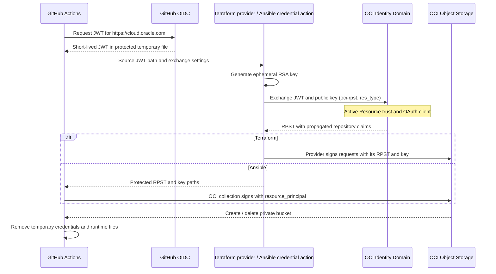

# OCI Workload Identity Federation for GitHub Actions

This reference implementation runs Terraform and Ansible from GitHub Actions
using OCI Workload Identity Federation (WIF) and ephemeral resource principal
session tokens (RPST). Neither workflow uses an OCI user API key.

Each demo creates one private Object Storage bucket and deletes it in the same
run. Terraform uses the OCI provider's native WIF authentication. Ansible
exchanges the GitHub OIDC token and uses the OCI collection's
`resource_principal` authentication.

| Demo | Workflow | Instructions |
| --- | --- | --- |
| Terraform bucket | Demo Terraform RPST Bucket | [Terraform](./examples/terraform/simple/README.md) |
| Ansible bucket | Demo Ansible RPST Bucket | [Ansible](./examples/ansible/bucket/README.md) |

Start with the [setup runbook](./SETUP.md). It covers the Identity Domain,
OAuth application, Resource trust, policies, repository secrets, execution,
troubleshooting, and cleanup. This is a demo for customers to copy and adapt.

## Authentication flow

```mermaid
sequenceDiagram
    participant Job as GitHub Actions
    participant GitHub as GitHub OIDC
    participant Runtime as Terraform provider / Ansible credential action
    participant Domain as OCI Identity Domain
    participant OCI as OCI Object Storage

    Job->>GitHub: Request JWT for https://cloud.oracle.com
    GitHub-->>Job: Short-lived JWT in protected temporary file
    Job->>Runtime: Source JWT path and exchange settings
    Runtime->>Runtime: Generate ephemeral RSA key
    Runtime->>Domain: Exchange JWT and public key (oci-rpst, res_type)
    Note over Domain: Active Resource trust and OAuth client
    Domain-->>Runtime: RPST with propagated repository claims
    alt Terraform
        Runtime->>OCI: Provider signs requests with its RPST and key
    else Ansible
        Runtime-->>Job: Protected RPST and key paths
        Job->>OCI: OCI collection signs with resource_principal
    end
    OCI-->>Job: Create / delete private bucket
    Job->>Job: Remove temporary credentials and runtime files
```

The Resource trust propagates `repository` and `workflow_ref`. IAM policies
restrict access to the executing repository and the chosen compartment.
No service user or group is required for the runtime identity.

Credentials, plans, and state stay under the runner's temporary directory.
The workflows delete them in an always-run cleanup step. Client secrets are
passed only to the steps that need them. Debug logging and credential uploads
are disabled.

## Execution evidence

Terraform 1.16.5 with OCI provider 9.8.0 completed token exchange, plan, creation,
and deletion of one bucket on 8 October 2026.
[Execution](https://github.com/dgutierrezcolodra/oci-terraform-github-actions-wif-example/actions/runs/37760577325).

## License

Copyright (c) 2026 Oracle and/or its affiliates. Licensed under the
[Universal Permissive License v1.0](./LICENSE.txt).
